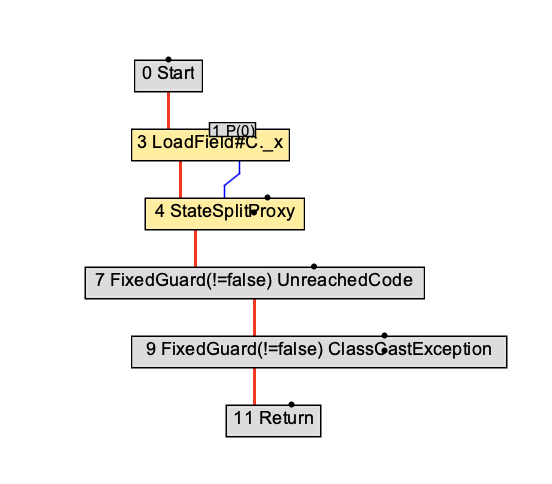
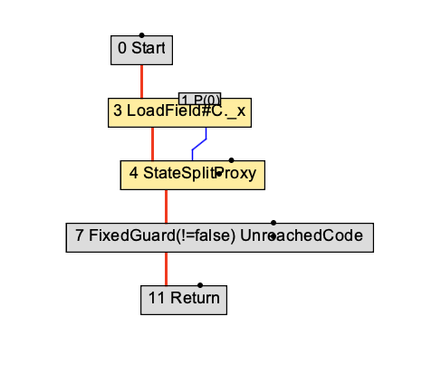
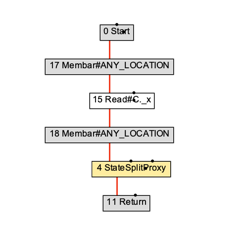

# Graal compilation of Lazy Val

## Code

For more detailed code, see [lazy.scala](./lazy.scala):

``` Scala
class C {
  def x: String = {
    val current = _x
    if (current.isInstanceOf[String])
      current.asInstanceOf[String]
    else
      x$lzy
  }

  def x$lzy: String = {
    val current = _x
    if (current.isInstanceOf[String])
      current.asInstanceOf[String]
    else {
      val offset = C.x_offset
      if (current == null) {
        if (LazyRuntime.isUnitialized(this, offset)) {
          try LazyRuntime.initialize(this, offset, 3 + "value")
          catch {
            case ex: Throwable =>
              LazyRuntime.initialize(this, offset, null)
              throw ex
          }
        }
      }
      else
        LazyRuntime.awaitInitialized(this, offset, current)
      x$lzy
    }
  }
}
```

## Graphs

Here are the graphs for the method `C.x`.

0 after parsing



1 before phase lowering



2 after high tier



3 after mid tier


4 after low tier


